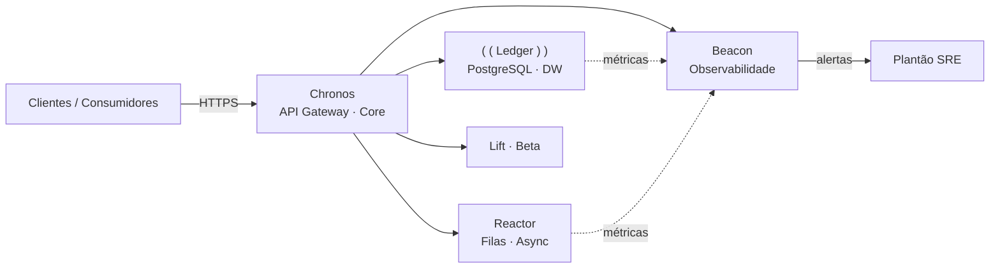
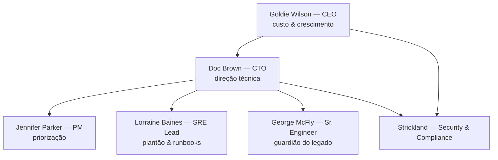

# ⚡ Um Dia na Hill Valley Tech

### Frameworks de Prompt Engineering aplicados à operação de IA — IAOps

> *Nesta realidade alternativa, o futuro ainda pode ser mudado — desde que o plantão esteja com os prompts certos na mão. Welcome to Hill Valley, October 26, 2026.*

---

## 🧭 Sumário

- [Sobre o desafio](#sobre-o-desafio)
- [O cenário: Hill Valley Tech](#-o-cenário-hill-valley-tech)
- [A plataforma: cinco sistemas em produção](#-a-plataforma-cinco-sistemas-em-produção)
- [O time: seis pessoas para fazer o sistema andar](#-o-time-seis-pessoas-para-fazer-o-sistema-andar)
- [O contrato de entrega](#-o-contrato-de-entrega)
- [Os frameworks do capítulo](#-os-frameworks-do-capítulo)
- [Mapa das questões](#-mapa-das-questões)
- [Resolução por questão](#-resolução-por-questão)
- [Estrutura do repositório](#-estrutura-do-repositório)
- [Checklist de entrega](#-checklist-de-entrega)

---

## 📌 Sobre o desafio

Este repositório reúne a resolução do desafio prático de **IAOps** sobre **Frameworks de Prompt Engineering**, ambientado na empresa fictícia **Hill Valley Tech (HVT)**.

Não é um exercício de escrever prompts por escrever: cada questão entrega um **prompt de IA aplicando um framework estruturado**, **executado em um modelo real**, com o **output registrado** e a **justificativa** provando onde cada componente do framework aparece no prompt. Ou seja — é engenharia, não reza. Se não dá para apontar no texto *onde* está o `Role`, o `Task` e o `Format` de um R-T-F, o prompt não foi engenhado.

A única exceção é a **Questão 08**, que foge do padrão: a escolha do framework fica a critério da autora (entre os cinco do capítulo), com **comparação explícita contra duas alternativas**.

---

## 🏢 O cenário: Hill Valley Tech

A Hill Valley Tech é uma empresa fictícia que serve de palco para este desafio. São cinco sistemas em produção, cada um com seu papel bem definido, e um time enxuto que precisa responder às demandas que chegam à mesa todos os dias.

**O segundo do futuro chegou. E ele está degradando.**

> Nos próximos cenários, as demandas que chegam à mesa do time são resolvidas uma a uma, cada uma com um framework de prompt engineering diferente. O objetivo é mostrar que **o mesmo modelo, com estruturas de prompt diferentes, entrega resultados radicalmente melhores — ou piores** — dependendo de como o contexto é organizado.

---

## 🗺️ A plataforma: cinco sistemas em produção

| Sistema | Papel | Notas da operação |
|---|---|---|
| **Chronos** | API Gateway e plataforma core | Ponto de entrada de todo o tráfego da empresa. Sofre de perto qualquer impacto em Ledger, Reactor e Lift. |
| **Ledger** | Data Warehouse em PostgreSQL | Guarda histórico de transações e eventos. Levantado por George McFly em uma EC2 *"há anos atrás"* — sem rotina de backup até hoje. |
| **Reactor** | Processamento assíncrono | Consume filas de mensagens. Quando o upstream falha, o backlog cresce rápido — e o lag vira alerta. |
| **Beacon** | Observabilidade | Métricas, logs e alertas do ambiente inteiro. É pela tela dele que o plantão enxerga o que está acontecendo. |
| **Lift** | Produto em beta | Em amadurecimento à parte do core. Uma API Python/Flask vivendo em VMs, prestes a entrar no cluster. |



---

## 👥 O time: seis pessoas para fazer o sistema andar

| Pessoa | Papel | Prisma pelo qual enxerga o sistema |
|---|---|---|
| **Doc Brown** | CTO | Direção técnica. É quem repassa análises e cobra a visão de arquitetura. |
| **Jennifer Parker** | Product Manager | Prioriza o que o produto entrega. Gate de "para quem" e "para quando". |
| **Lorraine Baines** | Líder de SRE | Responde pelo plantão. Cobra **runbooks e procedimentos documentados** — o seguro de vida da operação. |
| **George McFly** | Engenheiro Sênior veterano | Escreveu boa parte do legado. Muita coisa ainda roda exatamente como ele deixou anos atrás. |
| **Goldie Wilson** | CEO | Observa tudo pelo prisma de **custo e crescimento**. Guru dos números e da meta do trimestre. |
| **Strickland** | Head de Segurança & Compliance | Bate o carimbo nos padrões internos que todo código novo precisa seguir. Zero chave em plaintext, zero imagem `latest`. |



**A mecânica de cada questão:** a demanda chega de uma dessas pessoas (ou de um sistema), o time precisa aplicar um framework de prompt engineering para gerar o entregável, e o resultado precisa resolver o problema de verdade — com boas práticas, segurança e operabilidade.

---

## 📦 O contrato de entrega

Cada questão (da 01 à 07) segue **a mesma estrutura de avaliação**:

1. **Contexto / Enunciado** — a demanda que chega à mesa do time, como descrita na atividade.
2. **🤖 Prompt** — texto exato aplicado ao modelo, com os componentes do framework indicado.
3. **🛠️ Modelo** — qual modelo foi executado e por quê.
4. **📦 Output** — resultado registrado (arquivo gerado ou resposta do modelo), anexado/colado.
5. **💡 Justificativa** — mapeamento explícito de **como cada componente do framework apareceu no prompt** e a reflexão sobre o que mudaria na estrutura.

A **Questão 08** segue o mesmo contrato, mas pede **escolha livre entre os cinco frameworks do capítulo**, com comparação explícita contra **duas alternativas**.

---

## 🧩 Os frameworks do capítulo

| Acrônimo | Componentes | Métrica de foco | Usado em |
|---|---|---|---|
| **R-T-F** | **R**ole · **T**ask · **F**ormat | *Quem deve fazer, o que fazer e como entregar* | Q1 · Q2 · **Q8 (escolhido)** |
| **T-A-G** | **T**ask · **A**ction · **G**oal | *O que, quais ações e qual objetivo* | Q3 |
| **R-A-C-E** | **R**ole · **A**ction · **C**ontext · **E**xpectation | *Papel reforçado + expectativa de qualidade* | Q4–Q7 (conforme enunciado) |
| **C-O-A-S-T (Co-STAR)** | **C**ontext · **O**bjective · **A**ction · **S**cenario · **T**arget | *Máximo contexto para decisões complexas* | Q4–Q7 (conforme enunciado) |
| **R-O-S-E** | **R**ole · **O**bjective · **S**cenario · **E**xpected solution | *Solução esperada explícita* | Q4–Q7 (conforme enunciado) |

---

## 🧭 Mapa das questões

| # | Tema | Sistema | Demandante | Framework | Status |
|---|------|---------|-----------|-----------|--------|
| **01** | Dockerfile do Lift | Lift | Time de plataforma | R-T-F | ✅ Completa |
| **02** | Script de backup do Ledger | Ledger | Lorraine Baines (SRE) | R-T-F | ✅ Completa |
| **03** | Relatório de redução de custos cloud | Multi (AWS) | Goldie Wilson (CEO) | T-A-G | ⏳ Em andamento |
| **04** | *[conforme enunciado]* | — | — | — | 📝 Pendente |
| **05** | Deployment Kubernetes do Chronos | Chronos | — | — | 🧩 Artefatos prontos |
| **06** | *[conforme enunciado]* | — | — | — | 📝 Pendente |
| **07** | *[conforme enunciado]* | — | — | — | 📝 Pendente |
| **08** | Rollback vs. escalamento emergencial | Chronos + Ledger + Reactor + Beacon | Plantão SRE | Livre (R-T-F escolhido) | ✅ Completa |

> **Legenda:** ✅ resolvida · ⏳ ficha montada, falta executar/preencher · 🧩 artefatos gerados, ficha a consolidar · 📝 aguardando preenchimento do enunciado.

---

## 📋 Resolução por questão

### Questão 01 — Dockerfile para o Lift · _Framework: R-T-F_

**Contexto:** o Lift (API Python/Flask na porta 8080, com `requirements.txt`, `app.py`, `lib/` e `tests/`) vai sair das VMs e entrar no cluster Kubernetes. Falta o `Dockerfile`, seguindo boas práticas. O serviço sobe com `gunicorn --bind 0.0.0.0:8080 --workers 4 app:app` e precisa de `DATABASE_URL` e `API_KEY` no runtime.

<details>
<summary><b>🤖 Prompt executado</b> (R-T-F)</summary>

```text
#Role
Você é um DevOps sênior com mais de 15 anos experiência, especializado em Docker e Kubernetes.

#Task
Escreva um Dockerfile para geração da imagem do Lift.

O Lift é um projeto de API Python/Flask que tem as informações
- Porta 8080;
- Precisa das variáveis DATABASE_URL e API_KEY no runtime;
- Tem os requirements:
Flask==3.0.0
gunicorn==21.2.0
requests==2.31.0
python-dotenv==1.0.0
psycopg2-binary==2.9.9
- O serviço sobe com gunicorn --bind 0.0.0.0:8080 --workers 4 app:app

A estrutura do projeto é:

lift/
├── app.py
├── requirements.txt
├── lib/
│   ├── auth.py
│   └── storage.py
└── tests/
    └── test_app.py

#Format
Retorne um arquivo Dockerfile pronto escrito com boas práticas
```

</details>

- **🛠️ Modelo:** Sonnet 5 Médio — escolhido pelo bom discernimento em *best practices* de containerização.
- **📦 Output:** [`Dockerfile1`](Questão%201/Dockerfile1) e, após refino do `#Format`, [`Dockerfile2`](Questão%201/Dockerfile2) — multi-stage build, usuário não-root, `--no-cache-dir`, `ARG`/`ENV` parametrizados e stage `test` para CI.
- **💡 Justificativa:** o primeiro `#Format` era genérico ("anote boas práticas") e a resposta veio boa, mas não profissional o suficiente. Ao refinar o `Format` para exigir **multi-stage, reutilização entre ambientes, segurança e organização**, o Dockerfile2 ficou production-grade. Essa iteração é a prova prática de que **o `Format` é o componente que controla a qualidade do deliverable** no R-T-F.

---

### Questão 02 — Script de backup do Ledger · _Framework: R-T-F_

**Contexto:** o Ledger (PostgreSQL na EC2, `ledger-db.internal.hvt.io:5432`, banco `ledger_prod`) nunca teve rotina de backup. Lorraine quer fechar com uma cron diária: dump com `pg_dump`, compactar com `gzip`, subir para `hvt-ledger-backups` via `aws s3 cp`, retenção de 30 dias no S3, log em `/var/log/ledger-backup.log` e exit code adequado em falha.

<details>
<summary><b>🤖 Prompt executado</b> (R-T-F)</summary>

```text
#Role
Você é um Engenheiro SRE Sênior especializado em cloud AWS e infra.

#Task
Desenvolva um script bash que irá rodar em um host EC2 através de uma CRON diária
- Host: ledger-db.internal.hvt.io
- Porta: 5432
- Banco: ledger_prod
- Usuário de backup: backup_user
- Senha: variável de ambiente PGPASSWORD, populada pelo AWS Secrets Manager via IAM role da instância
- Região AWS: us-east-1
- SO da instância: Ubuntu 22.04 LTS
- Diretório de trabalho com 80 GB livres: /var/backups/ledger
- Tamanho médio atual do dump compactado: ~12 GB

#Format
Entregue um arquivo script bash pronto para execução. O script deve seguir o passo a passo:
- Execute o dump com pg_dump
- Compactar com gzip
- Subir o arquivo pro bucket S3 hvt-ledger-backups via aws s3 cp
- Manter 30 dias de retenção no S3 (removendo os mais antigos)
- registrar cada execução em /var/log/ledger-backup.
- log com timestamp
- sair com exit code adequado em caso de falha.
```

</details>

- **🛠️ Modelo:** Gemini 3.5 Flash — bom custo/benefício para geração de script operacional.
- **📦 Output:** [`script.sh`](Questão%202/script.sh) + guia de implementação: policy IAM de privilégio mínimo (Secrets Manager + S3), cron `0 2 * * *`, e observação de arquitetura sobre S3 Lifecycle Policy.
- **💡 Justificativa:** o `Role` de **SRE sênior AWS** foi calibrado para o perfil de Lorraine e para o ambiente declarado; o `Task` carregou os dados técnicos do host (DNS, porta, banco, usuário, SO, diretório, volume); o `Format` entregou o "passo a passo" do script, forçando o modelo a desenvolver o raciocínio na ordem correta de execução. A saída veio com orientações de **IAM, cron e lifecycle policy** — sinal de que o Role cumpriu seu papel.

---

### Questão 03 — Relatório de redução de custos cloud · _Framework: T-A-G_

**Contexto:** Goldie apresentou a meta de **15% de redução de custo cloud** no trimestre, sem degradar SLA. Doc Brown repassou o CSV com o breakdown AWS do último mês (12 serviços). O relatório precisa trazer **oportunidades priorizadas por impacto, percentual sobre a conta total, esforço de implementação (baixo/médio/alto) e riscos/pré-requisitos**, alinhado à meta de 15%. CSV completo no [enunciado da questão](Questão%203/README.md).

- **🛠️ Modelo:** *a definir* — recomenda-se Gemini 1.5 Pro ou Claude para análise de tabelas/CSV.
- **📦 Output:** *a preencher* — relatório em markdown priorizando, por exemplo: EC2 on-demand e RDS PostgreSQL como maiores alvos, CloudWatch Logs com retenção de 90 dias como candidato a redução, NAT Gateway e Data Transfer Out como alvos de arquitetura.
- **💡 Justificativa / T-A-G:** o `Task` declara "analise o CSV e produza um relatório priorizado"; o `Action` especifica as ações de análise (agrupar por serviço, calcular percentual sobre o total, classificar esforço e risco); o `Goal` ancora tudo à meta dos 15% da Goldie, impedindo que o modelo entregue um relatório genérico fora do objetivo de negócio.

> **⏳ Em andamento:** prompt, modelo, output e justificativa finais estão sendo preenchidos na [ficha da Questão 03](Questão%203/README.md).

---

### Questão 04 — *[Conforme enunciado da atividade]*

Ficha aberta em [`Questão 4/README.md`](Questão%204/README.md) seguindo o contrato de entrega (Contexto · Prompt · Modelo · Output · Justificativa). Framework a aplicar: um dos **R-A-C-E / C-O-A-S-T / R-O-S-E** do capítulo, conforme indicado no enunciado original.

---

### Questão 05 — Deployment Kubernetes do Chronos · _Artefatos prontos_

**Contexto:** o deployment básico do Chronos (1 réplica, senha em plaintext, imagem `latest`, sem probes, sem limits, rodando como root) precisa virar um deployment production-grade.

- **📦 Artefatos já gerados:**
  - [`README_COMPLETO.md`](Questão%205/README_COMPLETO.md) — guia didático *before/after* cobrindo replicas/PDB, secrets & ConfigMap, imagem versionada, resource limits, health probes, security context, rolling updates, HPA, NetworkPolicy, RBAC, Ingress com TLS e monitoramento.
  - [`deployment.yaml`](Questão%205/deployment.yaml) · [`advanced-resources.yaml`](Questão%205/advanced-resources.yaml) · [`secrets-and-config.yaml`](Questão%205/secrets-and-config.yaml) · [`deploy.sh`](Questão%205/deploy.sh)
- **🧩 Falta:** consolidar a ficha da questão (prompt → modelo → output → justificativa mapeando o framework aplicado).

---

### Questão 06 — *[Conforme enunciado da atividade]*

Ficha aberta em [`Questão 6/README.md`](Questão%206/README.md) seguindo o mesmo contrato de entrega.

---

### Questão 07 — *[Conforme enunciado da atividade]*

Ficha aberta em [`Questão 7/README.md`](Questão%207/README.md) seguindo o mesmo contrato de entrega.

---

### Questão 08 — Rollback vs. escalamento emergencial · _Framework livre (comparação contra 2 alternativas)_

**Contexto:** diante de degradação acelerada do Chronos após o deploy `v2.48.0` (pool de conexões exaurido, circuit breaker aberto, latência/erros subindo, backlog de ~800 msg/min no Reactor e lag crescendo), apoiar a decisão entre **rollback para v2.47.0** e **escalamento emergencial** (aumentar limites do RDS e pool de conexões), entregando um **post-mortem em markdown**.

**Framework escolhido: R-T-F** (entre os cinco do capítulo).

<details>
<summary><b>🤖 Prompt executado</b> (R-T-F)</summary>

```text
#ROLE
Você é um especialista SRE sênior com mais de 15 anos de experiência.

#TASK
Criar documento técnico que auxiie a decidir entre rollback do deploy v2.48.0 (que subiu ontem) e scaling emergencial (aumento de limits do RDS e do pool de conexões).

Evento do deploy anterior (ontem, 18:42 UTC):
Deploy chronos-api: v2.47.0 -> v2.48.0
Argo CD sync: 2026-04-23 18:42:11 UTC
Changelog:
- Adicionado endpoint POST /v2/transactions/batch
- Refatorado cliente do Ledger (pool de conexoes movido para nova biblioteca interna)
- Bump de psycopg 3.1.18 -> 3.2.0
- Reduzido timeout do Ledger de 5s para 2s

Métricas do Beacon nos últimos 30 minutos:
timestamp                p99_latency_ms   req_rate_s   err_rate_pct
2026-04-24 13:30 UTC     420              1200         0.2
...
2026-04-24 14:20 UTC     8100             2650         11.7

Trecho do log do pod chronos-api-79c4d8b9-xk2jp: [...] (pool exhausted, timeout 2000ms, circuit breaker OPEN, reactor publish error)
Estado do Reactor: 50.127 msg acumuladas, ~800/min, lag 18 min aumentando.
Estado do cluster: 12/12 pods, CPU 62%, memória 71%, conexões Ledger 240/250.

#FORMAT
Me retorne um documento post-mortem em markdown
```

</details>

- **🛠️ Modelo:** `opencode/big-pickle` (Claude/Anthropic via opencode).
- **📦 Output:** [`postmortem.md`](Questão%208/postmortem.md) — documento completo de apoio à decisão: classificação SEV-1, timeline consolidada, leitura de evidências, hipóteses de causa raiz ranqueadas, matriz de decisão, plano em *gates* com gatilhos objetivos de rollback obrigatório e checklist de evidências. Detalhes no [README da Questão 08](Questão%208/README.md).

#### 🔀 Comparação explícita: R-T-F (escolhido) vs. duas alternativas

| Dimensão | **R-T-F** (escolhido) | **T-A-G** (alternativa 1) | **C-O-A-S-T · Co-STAR** (alternativa 2) |
|---|---|---|---|
| **Foco** | Quem, o quê e **como entregar** | O quê, quais ações e **qual objetivo** | Contexto, objetivo, ações, cenário e **alvo de resposta** |
| **Controle de formato** | Forte — `#FORMAT` restringiu a saída a post-mortem em markdown | Fraco — sem seção de formato, o modelo decide a estrutura da saída | Médio — o "Target" orienta o tipo de resposta, mas sem padrão de layout explícito |
| **Profundidade de contexto** | Média — contexto vai dentro da Task | Média — contexto diluído entre Task/Action | **Alta** — `Context` e `Scenario` foram feitos para cargas pesadas de evidência |
| **Custo de construção** | Baixo (3 seções diretas) | Baixo (3 seções diretas) | Alto (5 seções, mais longas) |
| **Risco no cenário** | Baixo — Role controlou o jargão de SRE; Format garantiu o artefato | Médio — sem Role claro, o modelo pode assumir um perfil genérico e "achismo" | Médio — excelente em teoria, mas para *um artefato timestamp-urgente* o tamanho do prompt pesa |

**Por que o R-T-F venceu aqui:** a resposta ao incidente precisava de duas coisas — um **julgo de domínio** e um **artefato com o shape certo**. O `#Role` ("SRE sênior") produziu a semiologia correta (leitura de pool vs. `max_connections`, matriz de decisão, gatilhos de rollback), e o `#Format` ("documento post-mortem em markdown") garantiu que a saída já nascesse com a estrutura publicável, sem refino manual. O **Co-STAR ficou em segundo**: seria a escolha natural se o prompt precisasse carregar ainda mais contexto (múltiplos runbooks, políticas, SLA history), ao custo de um prompt bem mais longo. O **T-A-G ficou em terceiro**: ótimo para tarefas orientadas a *resultado de negócio* (como a Q3 e a meta dos 15%), mas sem Role e sem Format ele não entrega o controle de especialização e de layout que um post-mortem exige.

> 💡 **Lição da Questão 08:** o framework não é "o melhor" em abstrato — é o que **alinha o tipo de saída, o nível de especialização e a quantidade de contexto** com a natureza da demanda. Para decisão técnica urgente com artefato padronizado, o R-T-F foi o equilíbrio certo entre controle e agilidade.

---

## 🗂️ Estrutura do repositório

```
Frameworks de Prompt Engineering/
├── readme.md                         ← este documento (índice + narrativa + resumo das resoluções)
├── Questão 1/
│   ├── README.md                     ← enunciado + prompt + modelo + output + justificativa
│   ├── Dockerfile1                   ← output (versão inicial)
│   └── Dockerfile2                   ← output (após refino do #Format)
├── Questão 2/
│   ├── README.md                     ← enunciado + prompt + modelo + output + justificativa
│   └── script.sh                     ← output do backup do Ledger
├── Questão 3/
│   └── README.md                     ← enunciado (CSV) + ficha a preencher ⏳
├── Questão 4/
│   └── README.md                     ← ficha (template) 📝
├── Questão 5/
│   ├── README.md                     ← ficha (template) 🧩
│   ├── README_COMPLETO.md            ← guia production-grade do Chronos
│   ├── deployment.yaml
│   ├── advanced-resources.yaml
│   ├── secrets-and-config.yaml
│   └── deploy.sh
├── Questão 6/
│   └── README.md                     ← ficha (template) 📝
├── Questão 7/
│   └── README.md                     ← ficha (template) 📝
└── Questão 8/
    ├── README.md                     ← enunciado + prompt + modelo + justificativa + comparação
    └── postmortem.md                 ← output completo (decisão rollback vs. escala)
```

---

## ✅ Checklist de entrega

| # | Prompt aplicando o framework | Modelo executado | Output registrado | Justificativa (componentes no prompt) |
|---|:---:|:---:|:---:|:---:|
| **01** (R-T-F) | ✅ | ✅ | ✅ | ✅ |
| **02** (R-T-F) | ✅ | ✅ | ✅ | ✅ |
| **03** (T-A-G) | ⏳ | ⏳ | ⏳ | ⏳ |
| **04** | 📝 | 📝 | 📝 | 📝 |
| **05** | 🧩 | 🧩 | ✅ (artefatos) | 🧩 |
| **06** | 📝 | 📝 | 📝 | 📝 |
| **07** | 📝 | 📝 | 📝 | 📝 |
| **08** (livre + 2 alternativas) | ✅ | ✅ | ✅ | ✅ |

---

*Resolvido com a dualidade que a Hill Valley Tech exige: criatividade para o cenário, disciplina para a engenharia de prompts.*